# NFVbench in a VM: network design

This document describes the different network design options for running NFVbench traffic generator
in a VM on a network-intensive SR-IOV compute node located in the same IaaS as the compute node
under test.

## Introduction

Several parameters impact the network design of NFVbench traffic generator in a VM:

* VF or PF: whether NFVbench VM uses SR-IOV Virtual Functions (VF) or PCI pass-through physical
  functions (PF)
  
* 1 physnet or 3 physnets: whether the SR-IOV compute nodes have their physical interfaces in the
  same OpenStack physical network or in different ones

Sometimes the platform hardware will impose some limitations.  For instance, TRex does not work
with VFs on network cards using Intel 82599 controllers (eg Intel X520).

Sometimes, the plaform operator will choose to use one physnet or three physnets, and we need to
adapt to that setup.

The combination of those two parameters leads to 4 design options.  In this document, we will
present a network design for each option.  We will also order these options by preference to help
select the best one when it is possible to make a choice.  We will cover loopback test and PVP test,
and for PVP we will cover all classes of compute nodes found in Neutron-based IaaS
deployments: basic and compute-intensive, network-intensive OVS-DPDK and network-intensive SR-IOV.

## Options

* Option 1: PF, 3 physnets

* Option 2: PF, 1 physnet

* Option 3: VF, 3 physnets

* Option 4: VF, 1 physnet

### PF vs VF

Hardware compatibility matrix:

| Network card             | PF  | VF  |
| ------------------------ | --- | --- |
| Intel 82599 (Intel X520) | yes | no  |
| Intel X710               | yes | yes |
| Intel XX7V10             | yes | yes |

Traffic generator perf results:

| Network card             | Theoretical line rate | PF  | VF  |
| ------------------------ | --------------------- | --- | --- |
| Intel 82599 (Intel X520) | 20 Gbps  | 20 Gbps @fs>=64 | N/A |
| Intel X710               | 20 Gbps  | 18.8 Gbps @fs=64, 20 Gbps @fs>=128 | 18.9 Gbps @fs=64, 19.8 Gbps @fs=1518 |
| Intel XX7V10             | 50 Gbps  | 25 Gbps @fs=64, 49 Gbps @fs>=1024 | 15 Gbps @fs=64, 23 Gbps @fs=1518 |

Features:

* With VF, latency data is limited to the average value.  It is not possible to get the distribution
  of the latency values in the form of High Dynamic Range (HDR) Histograms.

Choosing between PF and VF:

* If possible, PF should be used.  This option is supported by severals Intel network cards we tested, and it allows the traffic generator to get closer to line rate when working with 25 Gbps interfaces.
  
* With PF, OpenStack cannot control the traffic output by NFVbench: NFVbench can write anything
  (eg any VLAN), so OpenStack cannot enforce the isolation of virtual networks.  This may lead
  some platform operators to refuse to use PF.  In this case, VF can be used as an alternative.

* In some cheap environments, the physical interfaces on the server may be shared between SR-IOV ports and OpenStack control plane.  In that case, PF cannot be used and VF could be used as an alternative.

### Number of physnets

Typical setups:

- A single physnet configured on the IaaS, typically named `oiaas-net`.  With this setup, it is not
  possible to guarantee that two SR-IOV virtual functions given to one VM will belong to distinct
  physical interfaces.  This will limit the capacity of the traffic generator in case it uses
  VFs, and this will limit the capacity of the loop VM when it is running on a SR-IOV compute nodes.

- 1 physnet for normal (virtio) interfaces (typically named `oiaas-net`) + 1 physnet for each SR-IOV
  interface found on a network-intensive SR-IOV compute nodes (typically named `physnetN` where
  `N` is the number of the physical interface supporting SR-IOV virtual functions)

  Example 1: when two interfaces can be used for SR-IOV virtual functions or PCI pass-through
  physical functions, we will have 3 physnets configured on the IaaS:

  - `iaas-net` for normal (virtio) ports
  - `physnet1` for the first SR-IOV physical interface on a SR-IOV compute node
  - `physnet2` for the second SR-IOV physical interface on a SR-IOV compute node

  Example 2: when four interfaces can be used for SR-IOV virtual functions or PCI pass-through
  physical functions, we will have 5 physnets configured on the IaaS:

  - `iaas-net` for normal (virtio) ports
  - `physnet1` for the first SR-IOV physical interface on a SR-IOV compute node
  - `physnet2` for the second SR-IOV physical interface on a SR-IOV compute node
  - `physnet3` for the third SR-IOV physical interface on a SR-IOV compute node
  - `physnet4` for the fourth SR-IOV physical interface on a SR-IOV compute node

## Option 1: PF, 3 physnets

For all the options using PF on NFVbench VM, and whatever the number of physnets, the interface
mapping will be the same:

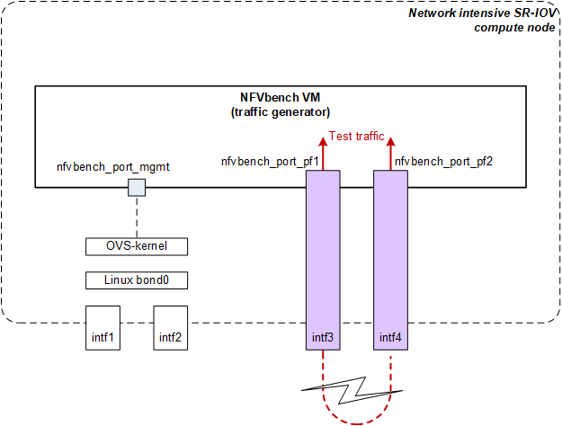

### Loopback test

The loopback test allows to characterize or to check the network performance of the traffic
generator.

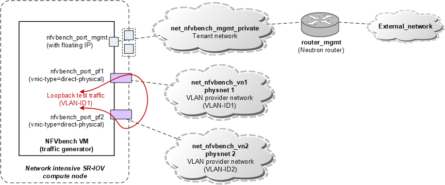

The loopback test traffic will use a single VLAN number (VLAN-ID1) and will be looped by the first
switch(es) on the path.

Because we use PCI pass-through physical functions (PF), OpenStack has absolutely no control on the
traffic emitted by the VM.  We will abuse this to send traffic tagged with VLAN-ID1 to
nfvbench_port_pf2, although that port is logically connected to a provider network configured with
VLAN-ID2.  This may look dirty, but this will allow us to do the loopback test and the PVP tests
without redeploying NFVbench VM.

### PVP test of SR-IOV compute node

When we deploy the loop VM on a SR-IOV compute node, we can reuse the provider networks used by
NFVbench VM (traffic generator) because the physical ports on the compute node belong to the same
physnets.

This leads to a straightforward network design:

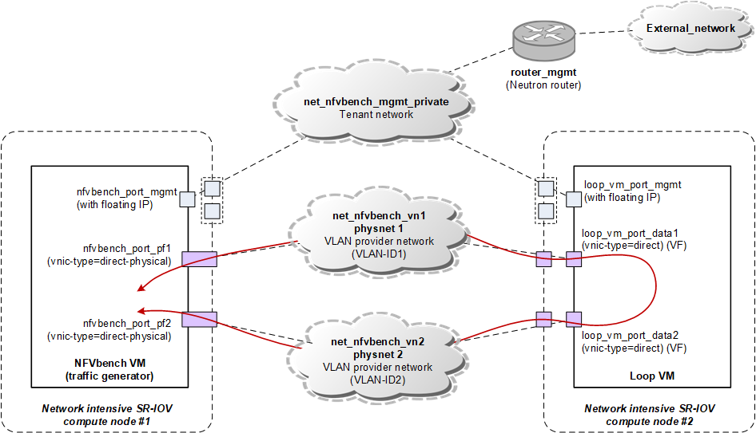

### PVP test of OVS-based compute nodes

For non SR-IOV compute nodes (basic, compute-intensive, network-intensive OVS-DPDK), the data plane of
the loop VM will use virtio ports connected to the OVS bridge.  That bridge belongs to the main
physnet (oiaas-net), so we cannot reuse the provider networks created for NFVBench traffic generator
VM: we need to create new provider networks using the same VLAN IDs.

For VM management, we need to have different virtual networks for the traffic generator VM
and the loop VM.   This is because it is not possible to use VLAN provider networks on the OVS
bridge of SR-IOV compute nodes, and not possible to use VXLAN tenant networks on the OVS-DPDK
compute nodes.  For other classes of compute nodes hosting the loop VM (basic, compute intensive),
we could use VLAN provider networks, but this is simpler to use the same design.

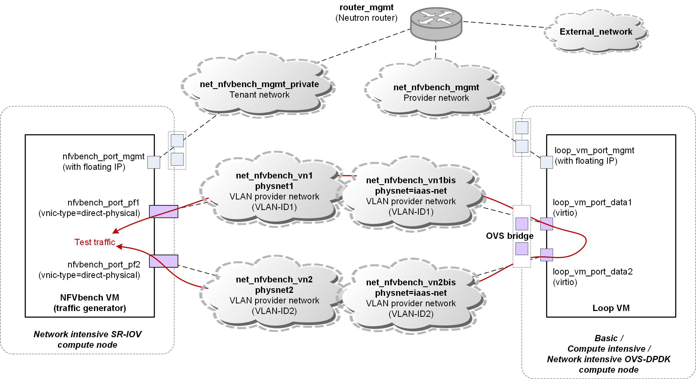

## Option 2: PF, 1 physnet

__Use case__: this option can be used as an alternative to option 1 when the IaaS platform
has been deployed with only one physnet.

__Limitation__: when testing SR-IOV compute node, the loop VM will in general have its two Virtual
Function ports on the same physical interface.  So its maximum throughput will be limited to the
throughput of a single physical interface (typically 10 Gbps or 25 Gbps depending on the hardware).

### Loopback test

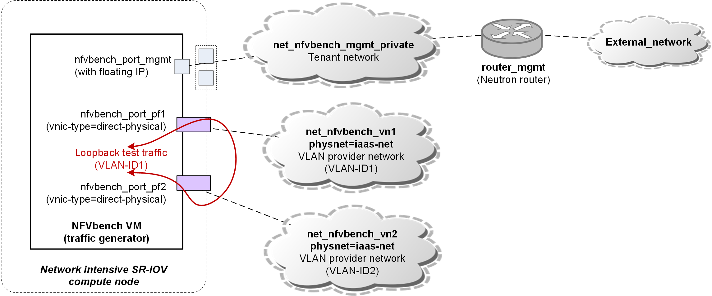

With option 2, the network design for the loopback test is very close to option 1.  The only
difference is that the two provider networks belong to the same physnet.

To avoid to redeploy the traffic generator VM between the loopback test and the PVP tests, we
re-use the same trick as in option 1: send test traffic with the wrong VLAN number in
`net_nfvbench_vn2`.

### PVP test of SR-IOV compute node

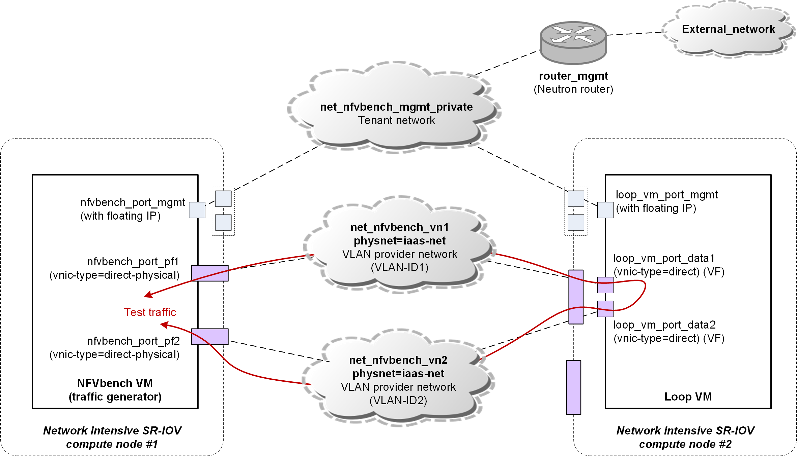

Here again, the network design is very close to option 1, the only difference is that the two
provider networks belong to the same physnet.  But because of that, the two VF ports created for
the VM will sometimes (and certainly after a fresh deployment) belong to the same physical
interface.  This will limit the max throughput test to the line rate of a single physical interface. 

### PVP test of OVS-based compute nodes

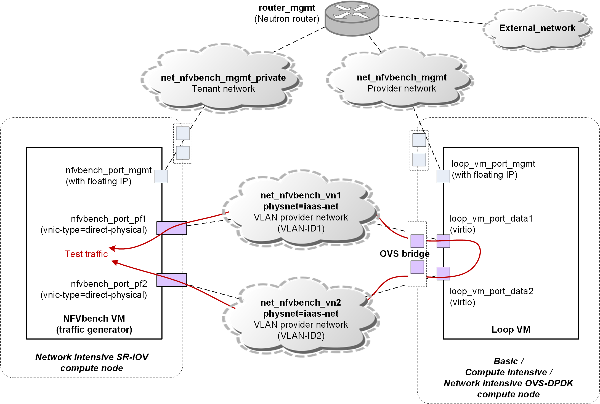

Except for the need to have separate management networks, here we have a clean and simple design
without any limitation.

## Option 3: VF, 3 physnets

__Use case__: this option can be used as an alternative to option 1 when the platform operator
fears that nfvbench usage of physical functions could break network isolation among tenants.

__Limitation__: when using Intel XXV710 cards on the generator (2x 25 Gbps), the maximum throughput
that can be sent by the generator will be limited.

### Physical interface mapping on the traffic generator VM

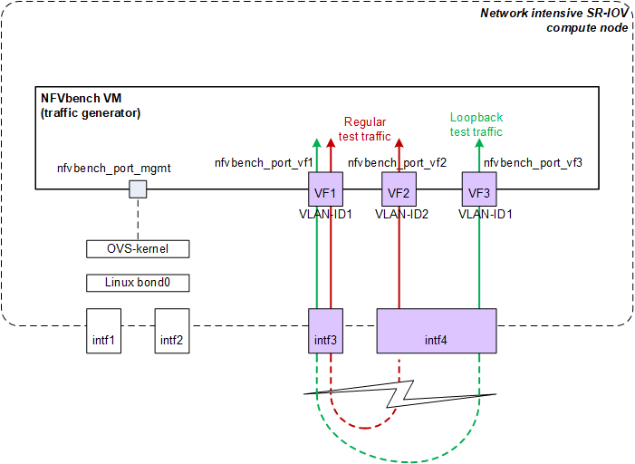

### Loopback test

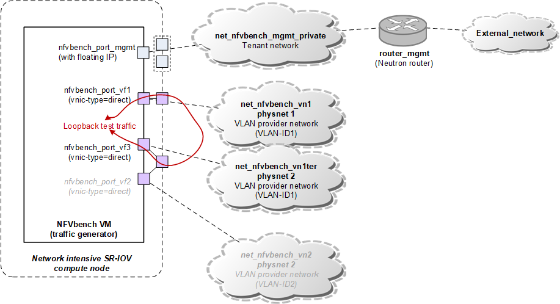

With VF, it is not possible to send traffic with the wrong VLAN ID: the traffic is tagged inside
the VF, not inside the VM.  To avoid to redeploy the traffic generator VM between a loopback test
and a PVP test, we create a third VF (`nfvbench_port_vf3`) and a third
VN (`net_nfvbench_vn1ter`).  This port and virtual network are only used during the loopback
test.  Also, during the loopback test, ports `nfvbench_port_vf2` and provider network
`net_nfvbench_vn2` are not used.

Remark: between a loopback test and a PVP test, it will be necesarry to change the PCI addresses
of the data ports in nfvbench config file.

### PVP test of SR-IOV compute node

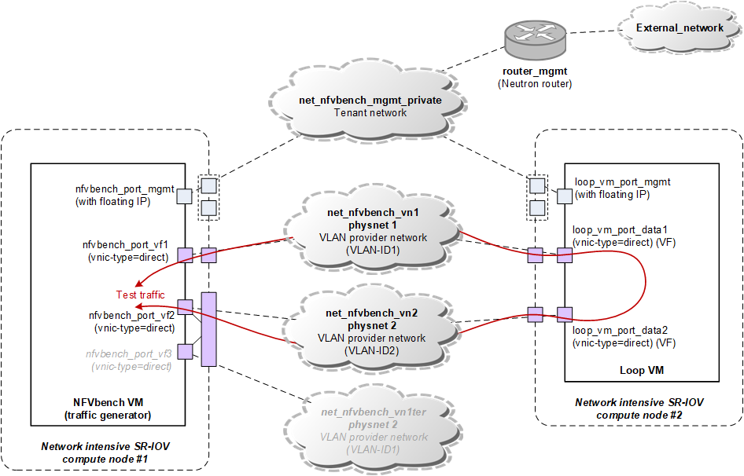

The design is close to option 1, except that we use VF instead of PF on the traffic generator.

Compared to the loopback test, here we use `nfvbench_port_vf2` and `net_nfvbench_vn2`, while
`nfvbench_port_vf3` and `net_nfvbench_vn1ter` remain unused.

### PVP test of OVS-based compute nodes

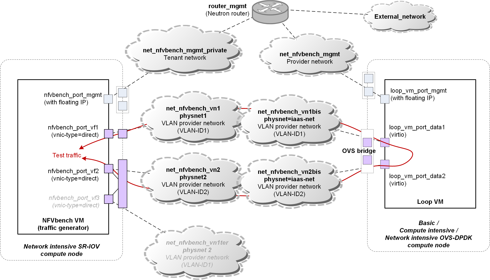

Same comment as previous case.

## Option 4: VF, 1 physnet

__Use case__: this option can be used for functional testing only when none of the other options
is feasible, eg on some development platforms.

__Limitation__: with this option, the traffic generator generally uses only one physical interface,
so its max throughput capacity is limited to the line rate of a single network interface (typically
10 Gbps or 25 Gbps, instead of the expected 20 Gbps or 50 Gbps).

### Physical interface mapping on the traffic generator VM

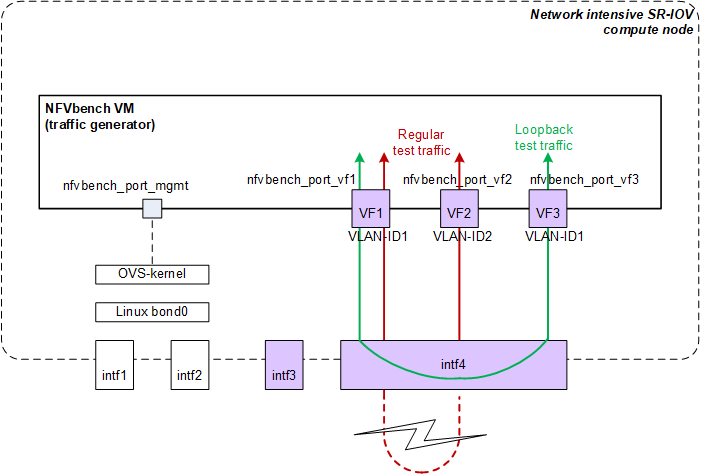

When the physical interfaces of a SR-IOV compute node belong to the same physnet, there is no way
to guarantee that a VM will get virtual function ports (VFs) from different physical interfaces.
Generally, the VFs will belong to the same physical interface, as reprsented on the figure above.

Because a VF is associated to a single VLAN ID, we need to create 3 VFs to be able to do the
loopback test and the PVP tests without re-creating nfvbench traffic generator VM.

### Loopback test

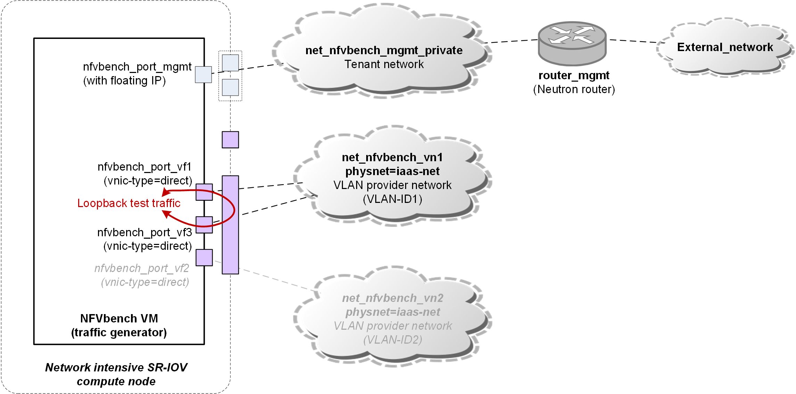

The loopback test uses two VFs with the same VLAN ID and that come from the same physical interface.
Consequently, the test traffic is looped by the virtual Ethernet bridge (VEB) inside the physical
network card and is not going out of the compute node.

In this case (option 4), we cannot use the loopback test to characterize the max throughput of the
traffic generator VM: the loopback test traffic will not use the same path as the PVP test traffic,
and the loopback test traffic will not be limited by the line rate of a single interface.

However, the loopback test can still be useful to check that the traffic generator VM is up and
running and can be controlled remotely.

### PVP test of SR-IOV compute node

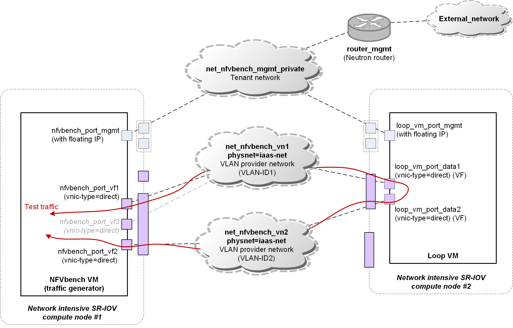

In this case (option 4), there are two limitations to the max throughput test of a SR-IOV compute
node: both the traffic generator VM and the loop VM are limited by the line rate of a single network
interface.

### PVP test of OVS-based compute nodes

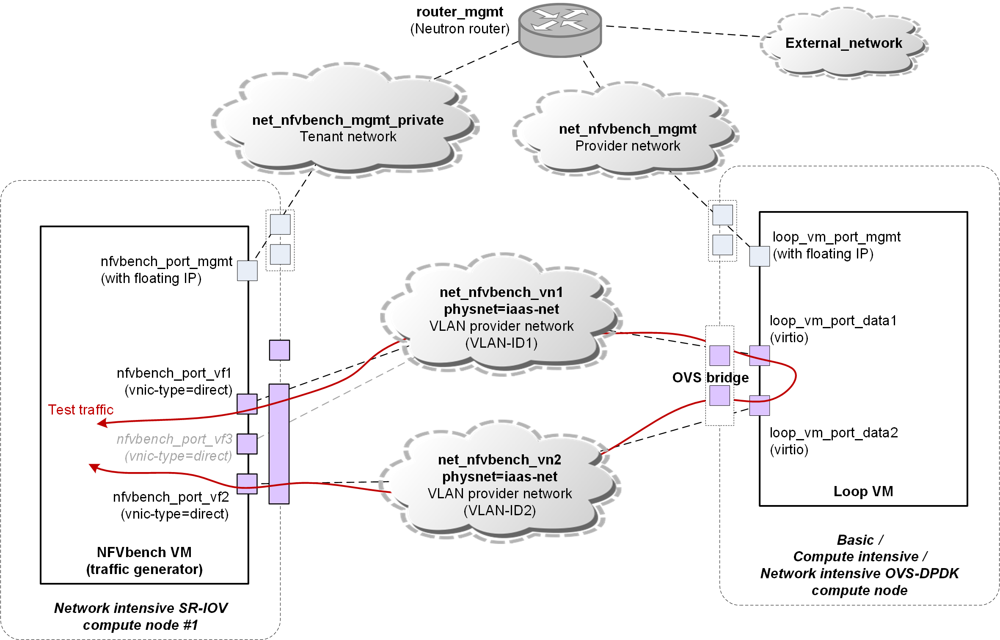

In this case (option 4), the traffic generator VM is limited by the line rate of a single network
interface.  But the OVS-based compute node under test does not suffer from that limitation.